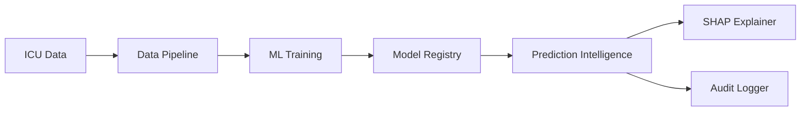
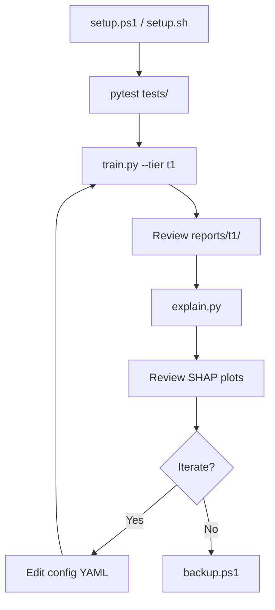
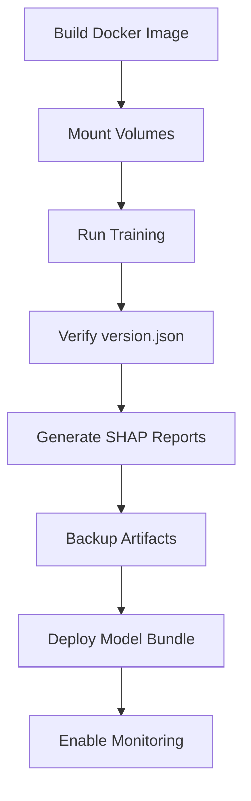

# PREMONITION

**Real-time AI early-warning system for ICU patient deterioration (sepsis prediction).**

[](https://python.org)
[](LICENSE)
[](#testing)

> Internship Portfolio Project — Production-grade ML pipeline with explainable AI, audit logging, and Docker deployment.

---

## Overview

PREMONITION predicts sepsis risk in ICU patients using **leakage-safe vital sign features** — before concurrent severity scores (SOFA, APACHE) or treatment interventions appear. Every prediction includes a **SHAP-based explanation** suitable for clinical review.

| Property | Value |
|----------|-------|
| Dataset | 5,000 ICU patients, 77 columns |
| Target | Sepsis (15% prevalence) |
| Feature tier | T1 — vitals + instability (53 features) |
| Best model | Logistic Regression (auto-selected by PR-AUC) |
| Test PR-AUC | **0.956** |
| Test Recall | **94.7%** |

---

## Screenshots

> Place screenshots in `docs/images/` after running the pipeline.

| Dashboard | Description |
|-----------|-------------|
|  | Model comparison bar chart |
|  | Global SHAP feature importance |
|  | Test set confusion matrix |
|  | Patient-level explanation report |
|  | Feature ranking for clinicians |

*Run `python scripts/explain.py` then copy plots from `reports/t1/` to `docs/images/`.*

---

## Architecture



Full architecture: [docs/ARCHITECTURE.md](docs/ARCHITECTURE.md)

---

## Quick Start (One Command)

### Windows (PowerShell)

```powershell
git clone <your-repo-url>
cd premonition
.\scripts\setup.ps1
python scripts/train.py --tier t1
python scripts/explain.py
```

### Linux / macOS

```bash
git clone <your-repo-url>
cd premonition
bash scripts/setup.sh
make train
make explain
```

### Docker

```bash
docker compose build
docker compose run --rm premonition-ml train
docker compose run --rm premonition-ml explain
```

---

## Project Structure

```
premonition/
├── data/
│   ├── raw/dataset.csv              # Source ICU dataset
│   └── processed/t1/                  # Train/val/test splits
├── models/artifacts/t1/
│   └── best_model/                  # Production model bundle
├── reports/t1/                      # Metrics, SHAP plots, patient reports
├── logs/
│   ├── premonition.log              # Application log
│   └── predictions/                 # Audit trail (JSONL)
├── src/premonition/
│   ├── config/                      # Feature tiers, model config
│   ├── data/                        # Pipeline, validators, preprocessors
│   ├── features/                    # Engineering, registry
│   ├── models/                      # LR, RF, XGBoost, registry
│   ├── training/                    # Train, evaluate, select
│   ├── explainability/              # SHAP, patient reports
│   └── intelligence/                # Predict + explain
├── scripts/
│   ├── train.py                     # Train all models
│   ├── explain.py                   # Generate SHAP reports
│   ├── setup.ps1 / setup.sh         # One-command setup
│   └── backup.ps1 / backup.sh         # Backup artifacts
├── infra/
│   ├── logging/logging.yaml         # Log rotation config
│   └── monitoring/prometheus.yml    # Metrics (future API)
├── docs/
│   ├── ARCHITECTURE.md
│   ├── ARTIFACT_MANAGEMENT.md
│   └── BACKUP.md
├── tests/                           # 25 automated tests
├── Dockerfile
├── docker-compose.yml
├── Makefile
├── requirements.txt
└── .env.example
```

---

## Setup Instructions

### Prerequisites

| Requirement | Version |
|-------------|---------|
| Python | 3.10 or higher |
| pip | Latest |
| Git | Any |
| Docker (optional) | 20.10+ |

### Step-by-Step

**1. Clone and enter the project**

```bash
git clone <your-repo-url>
cd premonition
```

**2. Create environment**

```bash
# Windows
python -m venv .venv
.\.venv\Scripts\Activate.ps1

# Linux/macOS
python3 -m venv .venv
source .venv/bin/activate
```

**3. Install dependencies**

```bash
pip install -r requirements-dev.txt
```

**4. Configure environment**

```bash
# Windows
copy .env.example .env

# Linux/macOS
cp .env.example .env
```

**5. Place dataset**

Copy your `dataset.csv` to `data/raw/dataset.csv` (included in repo).

**6. Verify installation**

```bash
python -m pytest tests/ -v
```

---

## Local Development Workflow



| Step | Command | Output |
|------|---------|--------|
| Setup | `.\scripts\setup.ps1` | venv + deps + .env |
| Test | `make test` | 25 tests pass |
| Train | `make train` | Models in `models/artifacts/` |
| Explain | `make explain` | SHAP plots in `reports/` |
| Lint | `make lint` | Ruff code quality |
| Backup | `.\scripts\backup.ps1` | Zip in `backups/` |

---

## Production Deployment Workflow



### Docker Production Deploy

```bash
# 1. Build
docker compose build

# 2. Train (persists to mounted volumes)
docker compose run --rm premonition-ml train

# 3. Explain
docker compose run --rm premonition-ml explain

# 4. Verify model
docker compose run --rm premonition-ml test

# 5. Optional: start monitoring
docker compose --profile monitoring up -d prometheus
# Access Prometheus at http://localhost:9090
```

### Volume Mounts (Persistent Data)

| Host Path | Container Path | Purpose |
|-----------|---------------|---------|
| `./models/artifacts` | `/app/models/artifacts` | Trained models |
| `./reports` | `/app/reports` | Metrics + SHAP |
| `./logs` | `/app/logs` | Audit trail |
| `./backups` | `/app/backups` | Backup archives |

---

## Model Performance

### Validation Results (Model Selection)

| Model | Accuracy | Precision | Recall | F1 | ROC-AUC | **PR-AUC** |
|-------|----------|-----------|--------|-----|---------|------------|
| **Logistic Regression** | 0.960 | 0.816 | 0.947 | 0.877 | 0.993 | **0.969** |
| XGBoost | 0.976 | 0.909 | 0.933 | 0.921 | 0.992 | 0.968 |
| Random Forest | 0.972 | 0.896 | 0.920 | 0.908 | 0.989 | 0.960 |

*Selected by highest validation PR-AUC (primary metric for imbalanced data).*

### Test Results (Final — Held-Out)

| Metric | Value |
|--------|-------|
| **PR-AUC** | 0.956 |
| **ROC-AUC** | 0.988 |
| **Recall** | 94.7% |
| **Precision** | 76.3% |
| **F1** | 0.845 |
| **Accuracy** | 94.8% |

### Confusion Matrix (Test)

|  | Predicted No | Predicted Yes |
|--|-------------|---------------|
| **Actual No** | 403 (TN) | 22 (FP) |
| **Actual Yes** | 4 (FN) | 71 (TP) |

> Only 4 of 75 sepsis cases missed (94.7% recall). 22 false alarms from 425 non-sepsis patients.

---

## Explainability

Every prediction includes a clinician-readable explanation powered by SHAP.

### Example Patient Report

```
Patient ID: 61210
Predicted Sepsis Risk: 100%
Prediction: SEPSIS ALERT
Prediction Confidence: High

Top Contributing Factors:
  1. Mean Oxygen Saturation (+25%)
  2. Peak Temperature (-23%)
  3. Minimum Temperature (-22%)
  4. Spo2 Max (+6%)
  5. Minimum Oxygen Saturation (+6%)

Why risk INCREASED:
  - Mean Oxygen Saturation pushed risk up

Why risk DECREASED:
  - Peak Temperature pushed risk down
```

### SHAP Visualizations Generated

| Plot | File | Purpose |
|------|------|---------|
| Summary (beeswarm) | `shap_summary.png` | Global feature impact |
| Bar chart | `shap_bar.png` | Mean |SHAP| ranking |
| Global ranking | `global_feature_ranking.png` | CEO/clinician dashboard |
| Waterfall | `waterfall_patient_{id}.png` | Single patient breakdown |
| Force | `force_patient_{id}.html` | Interactive push/pull view |

```bash
python scripts/explain.py --n-samples 5
python scripts/explain.py --patient-id 61210
```

---

## Audit Logging

Every prediction is logged for compliance and analytics.

**File:** `logs/predictions/predictions_YYYY-MM-DD.jsonl`

```json
{
  "timestamp": "2026-06-05T14:07:19Z",
  "patient_id": "61210",
  "risk_score": 0.9999,
  "risk_pct": "100.0%",
  "prediction": 1,
  "confidence": "High",
  "model_name": "logistic_regression",
  "model_version": "0.1.0",
  "explanation_summary": "High sepsis risk (100%) primarily driven by...",
  "top_factors": ["Mean Oxygen Saturation", "Peak Temperature"]
}
```

Designed for future CEO dashboard integration and HIPAA audit trails.

---

## Model Artifact Management

Each trained model is saved with full provenance:

```
models/artifacts/t1/best_model/
├── model.joblib
├── preprocessor.joblib
├── metrics.json
├── metadata.json
└── version.json        # model version, dataset hash, feature set, timestamp
```

Details: [docs/ARTIFACT_MANAGEMENT.md](docs/ARTIFACT_MANAGEMENT.md)

---

## Logging & Monitoring

| Component | Config | Purpose |
|-----------|--------|---------|
| Application log | `infra/logging/logging.yaml` | Rotating file (10 MB, 5 backups) |
| Audit log | `logs/prediction_audit.log` | JSON prediction events (90-day rotation) |
| Prometheus | `infra/monitoring/prometheus.yml` | Metrics scraping (future API) |
| Alert rules | `infra/monitoring/alert_rules.yml` | Latency + alert rate alerts |

Enable file logging in `.env`:
```
PREMONITION_LOG_FILE=./logs/premonition.log
```

---

## Backup Strategy

```powershell
# Windows
.\scripts\backup.ps1

# Linux
bash scripts/backup.sh
```

Backs up: models, reports, logs, configs. Keeps last 10 archives.

Details: [docs/BACKUP.md](docs/BACKUP.md)

---

## Testing

```bash
python -m pytest tests/ -v                  # All 25 tests
python -m pytest tests/ -v --cov=premonition  # With coverage
make test                                    # Via Makefile
docker compose run --rm premonition-ml test    # In Docker
```

| Test Suite | Tests | Coverage |
|------------|-------|----------|
| Data pipeline | 10 | Load, validate, engineer, split, preprocess |
| Training pipeline | 6 | Train, evaluate, select, persist |
| Explainability | 9 | SHAP, reports, logging, intelligence |

---

## Configuration

All settings via `.env` or environment variables:

| Variable | Default | Description |
|----------|---------|-------------|
| `PREMONITION_TIER` | `t1` | Feature tier (t0/t1/t2) |
| `PREMONITION_MODEL` | `xgboost` | Primary model candidate |
| `PREMONITION_LOG_LEVEL` | `INFO` | Logging verbosity |
| `PREMONITION_RANDOM_STATE` | `42` | Reproducibility seed |

Feature tiers and model hyperparameters: `src/premonition/config/`

---

## Future Roadmap

| Phase | Status | Deliverable |
|-------|--------|-------------|
| 1. Scaffold | Done | Project structure, config |
| 2. API | Planned | FastAPI prediction endpoints |
| 3. Data Pipeline | Done | Leakage-safe preprocessing |
| 4. ML Training | Done | LR + RF + XGBoost + auto-select |
| 5. Explainability | Done | SHAP + patient reports + audit log |
| 6. Infrastructure | Done | Docker, logging, monitoring, docs |
| 7. API Backend | Next | REST endpoints for predictions |
| 8. Dashboard | Planned | React clinician UI |
| 9. Streaming | Planned | Real-time vitals + 6h/12h forecasts |
| 10. Clinical Validation | Planned | Shadow mode + FHIR integration |

---

## Tech Stack

| Layer | Technology |
|-------|-----------|
| Language | Python 3.10+ |
| ML | scikit-learn, XGBoost |
| Explainability | SHAP |
| Data | pandas, pyarrow |
| Config | YAML, pydantic, python-dotenv |
| Testing | pytest |
| Container | Docker, docker-compose |
| Monitoring | Prometheus (ready) |
| Linting | ruff |

---

## License

MIT License — see [LICENSE](LICENSE).

---

## Author

Built as an internship portfolio project demonstrating production-grade ML engineering: leakage-safe feature engineering, automated model selection, SHAP explainability, audit logging, and Docker deployment.
