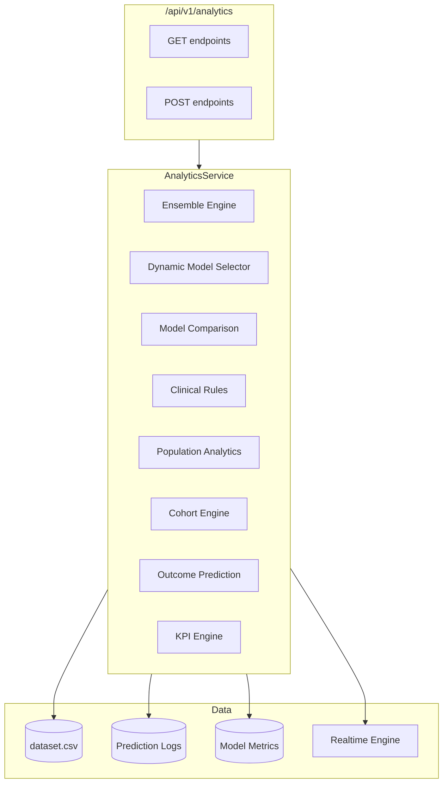

# PREMONITION — Section 11 Analytics Platform

## Folder Structure

```
src/premonition/analytics/
├── __init__.py
├── schemas.py                  # Pydantic request/response models
├── service.py                  # AnalyticsService facade
├── ensemble.py                 # Multi-model ensemble engine
├── model_selection.py          # Dynamic model routing
├── benchmarking.py             # Model benchmarking framework
├── comparison.py               # LR vs RF vs XGBoost comparison
├── explainability_compare.py   # SHAP/importance comparison
├── decision_audit.py           # AI decision audit framework
├── clinical_rules.py           # Sepsis-3 clinical rule engine
├── risk_stratification.py      # Risk tier stratification
├── population.py               # Population health analytics
├── cohorts.py                  # Cohort segmentation
├── outcomes.py                 # Outcome prediction framework
├── trajectory.py               # Patient trajectory analysis
├── recommendations.py          # Clinical recommendation ranking
├── alert_prioritization.py     # Alert prioritization AI
├── escalation.py               # Smart escalation workflow
├── executive.py                # Executive intelligence service
├── operational.py              # Operational analytics
├── capacity.py                 # ICU capacity forecasting
├── resources.py                # Resource utilization analytics
└── kpis.py                     # Hospital KPI engine

src/premonition/api/routes/analytics.py   # REST API endpoints
tests/
├── test_analytics_ensemble.py
├── test_analytics_models.py
├── test_analytics_clinical.py
├── test_analytics_population.py
├── test_analytics_outcomes.py
├── test_analytics_operations.py
└── test_analytics_api.py
```

## Architecture



## API Endpoints

| Method | Endpoint | Description |
|--------|----------|-------------|
| GET | `/api/v1/analytics/executive` | Executive dashboard KPIs |
| GET | `/api/v1/analytics/population` | Population health metrics |
| GET | `/api/v1/analytics/cohorts` | Cohort segmentation |
| GET | `/api/v1/analytics/outcomes` | Outcome forecast overview |
| GET | `/api/v1/analytics/capacity` | ICU capacity forecasting |
| GET | `/api/v1/analytics/resources` | Resource utilization |
| GET | `/api/v1/analytics/kpis` | Hospital-wide KPIs |
| POST | `/api/v1/analytics/simulate` | Scenario simulation |
| POST | `/api/v1/analytics/compare-models` | LR vs RF vs XGBoost |
| POST | `/api/v1/analytics/recommendations` | Clinical action ranking |
| POST | `/api/v1/analytics/risk-stratification` | Risk tier distribution |
| POST | `/api/v1/analytics/cohort-analysis` | Detailed cohort analysis |
| POST | `/api/v1/analytics/outcome-prediction` | Patient outcome forecast |

## Examples

### Executive Dashboard
```json
GET /api/v1/analytics/executive
{
  "kpis": {
    "icu_patients": 10,
    "predictions_today": 42,
    "model_pr_auc": 0.9561
  },
  "risk_overview": { "distribution": {"low": 20, "high": 5} }
}
```

### Model Comparison
```json
POST /api/v1/analytics/compare-models
{
  "winner": "logistic_regression",
  "models": [
    {"model_name": "logistic_regression", "pr_auc": 0.9686, "rank": 1},
    {"model_name": "xgboost", "pr_auc": 0.9642, "rank": 2},
    {"model_name": "random_forest", "pr_auc": 0.9580, "rank": 3}
  ]
}
```

### Cohort Analysis
```json
POST /api/v1/analytics/cohort-analysis
{"segment_by": "age_group"}
[
  {"name": "elderly", "size": 85, "sepsis_rate": 0.22, "avg_risk_score": 0.31}
]
```

### Hospital KPIs
```json
GET /api/v1/analytics/kpis
{
  "sepsis_detection_rate": 0.9467,
  "false_positive_rate": 0.071,
  "model_uptime_pct": 100.0,
  "predictions_per_day": 42
}
```
