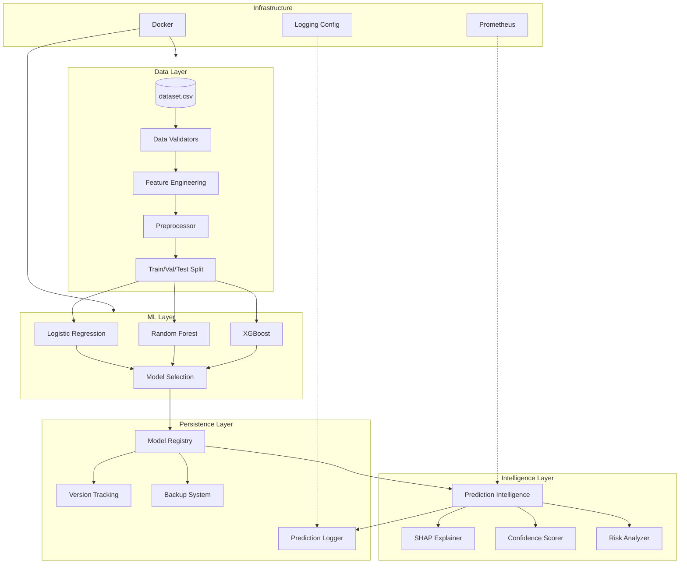
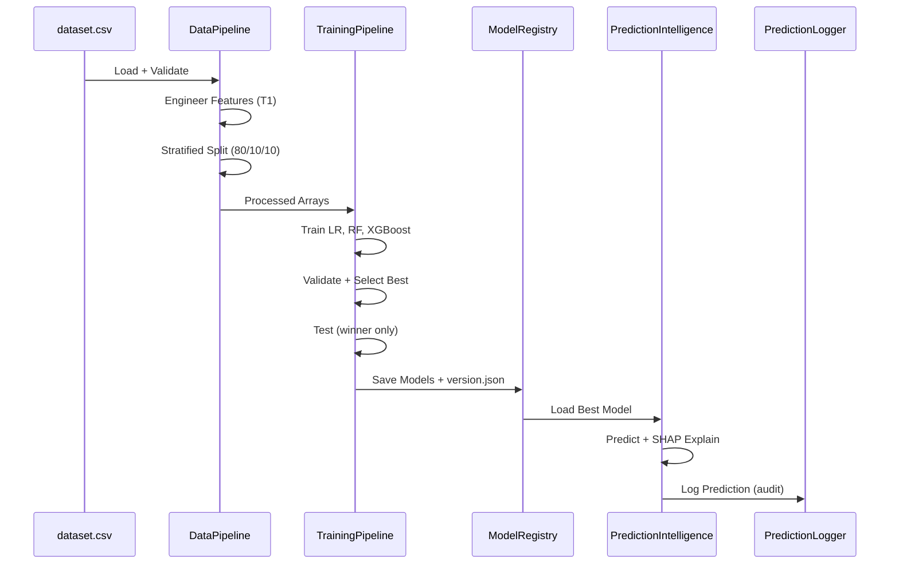

# PREMONITION — System Architecture

> Real-time AI early-warning system for ICU patient deterioration (sepsis).

---

## 1. High-Level Architecture



---

## 2. Data Flow



---

## 3. Feature Tier Architecture

| Tier | Features | Use Case |
|------|----------|----------|
| **T0** | Demographics + comorbidities (21) | Admission risk baseline |
| **T1** | T0 + vital aggregates + instability (53) | **Honest early-warning (primary)** |
| **T2** | T1 + labs + missing indicators (67) | When lab results available |

**Excluded (leakage policy):** SOFA, APACHE, qSOFA, SIRS, interventions, `pao2_fio2_ratio`, `mechanical_ventilation`.

---

## 4. Module Map

```
src/premonition/
├── config/          Settings, feature tiers, model config
├── data/            Load, validate, preprocess, split
├── features/        Engineering, feature registry
├── models/          LR, RF, XGBoost, registry, versioning, prediction logger
├── training/        Train, evaluate, compare, select
├── explainability/  SHAP, patient reports, plots
├── intelligence/    Predict + explain + confidence + risk analysis
├── utils/           Logging, paths, serialization
└── api/             (Phase 7 — not yet implemented)
```

---

## 5. Model Artifact Structure

```
models/artifacts/t1/
├── best_model/
│   ├── model.joblib          # Selected model (logistic_regression)
│   ├── preprocessor.joblib   # Fitted preprocessor
│   ├── metrics.json          # Validation + test metrics
│   ├── metadata.json         # Runtime metadata
│   └── version.json          # Full provenance record
├── xgboost_{timestamp}/
├── random_forest_{timestamp}/
└── logistic_regression_{timestamp}/
```

---

## 6. Audit Trail Architecture

Every prediction generates two records:

1. **JSONL log** — `logs/predictions/predictions_YYYY-MM-DD.jsonl`
2. **Rotating audit log** — `logs/prediction_audit.log` (when YAML logging active)

Each record contains: timestamp, patient_id, risk_score, prediction, confidence, explanation_summary, top_factors, model_version.

---

## 7. Deployment Architecture

| Environment | Method | Command |
|-------------|--------|---------|
| **Local (Windows)** | PowerShell setup | `.\scripts\setup.ps1` |
| **Local (Linux)** | Bash setup | `bash scripts/setup.sh` |
| **Docker** | Container | `docker compose run --rm premonition-ml train` |
| **Production** | Docker + volumes | Persistent mounts for models/logs/reports |

---

## 8. Security Considerations

- Docker runs as non-root user (`premonition`)
- No PHI in logs (only `subject_id` integers)
- `.env` excluded from git
- Model artifacts versioned with dataset hash for traceability
- Backup retention policy (last 10 archives)

---

## 9. Phase Roadmap

| Phase | Status | Description |
|-------|--------|-------------|
| 1 | Done | Project scaffold + config |
| 2 | Skipped | API (deferred) |
| 3 | Done | Data pipeline + preprocessing |
| 4 | Done | ML training + model selection |
| 5 | Done | SHAP explainability + intelligence |
| 6 | Done | Infrastructure + documentation |
| 7 | Planned | FastAPI backend |
| 8 | Planned | React clinician dashboard |
| 9 | Planned | Streaming vitals + multi-horizon forecasting |
| 10 | Planned | FHIR integration + clinical validation |
