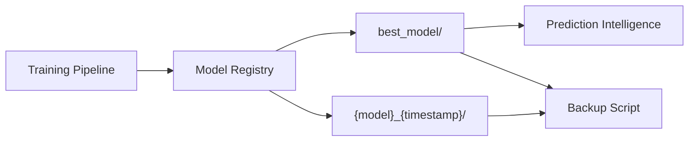

# Model Artifact Management

## Overview

PREMONITION stores every trained model as a versioned bundle with full provenance tracking. This ensures reproducibility and auditability.

---

## Artifact Lifecycle



---

## Bundle Contents

| File | Purpose | Required |
|------|---------|----------|
| `model.joblib` | Trained estimator wrapper | Yes |
| `preprocessor.joblib` | Fitted preprocessor (best model only) | Best only |
| `metrics.json` | Validation + test metrics | Yes |
| `metadata.json` | Feature names, selection info | Yes |
| `version.json` | Full provenance record | Yes |

---

## version.json Schema

```json
{
  "model_version": "0.1.0",
  "model_name": "logistic_regression",
  "tier": "t1",
  "training_timestamp": "2026-06-05T13:56:46Z",
  "dataset_version": {
    "filename": "dataset.csv",
    "content_hash": "abc123def456",
    "size_bytes": 1234567,
    "last_modified": "2026-06-05T10:00:00Z"
  },
  "metrics": { "validation": { "pr_auc": 0.9686 } },
  "feature_set": ["age", "shock_index", "hr_std", "..."],
  "n_features": 64,
  "is_best": true
}
```

---

## Loading Models

```python
from premonition.models import ModelRegistry

registry = ModelRegistry(models_dir)

# Load best model for production
model = registry.load_best_model("t1")
preprocessor = registry.load_preprocessor("t1")
metadata = registry.load_metadata("t1")
version = registry.load_version("t1")

# List all saved models
all_models = registry.list_models("t1")
```

---

## Best Practices

1. **Never overwrite `best_model/` manually** — let the training pipeline select and save.
2. **Keep timestamped archives** — each training run creates `{model}_{timestamp}/` bundles.
3. **Verify dataset hash** — compare `version.json` dataset hash before deploying.
4. **Backup before retraining** — run `scripts/backup.sh` or `scripts/backup.ps1`.
5. **Do not commit large model files to git** — use artifact storage or `.gitignore`.

---

## Retention Policy

| Artifact | Retention | Location |
|----------|-----------|----------|
| Best model | Permanent (until retrained) | `models/artifacts/t1/best_model/` |
| Training archives | Last 10 backups | `backups/` |
| Prediction logs | 90 days (rotating) | `logs/predictions/` |
| SHAP reports | Per-run timestamped | `reports/t1/explainability_{stamp}/` |
| Processed splits | Per-run | `data/processed/t1/` |

---

## Reproducibility Checklist

- [ ] `PREMONITION_RANDOM_STATE=42` in `.env`
- [ ] Same `dataset.csv` (verify `content_hash` in `version.json`)
- [ ] Same `feature_tiers.yaml` and `model_config.yaml`
- [ ] Same Python version (3.10+)
- [ ] Same dependency versions (`requirements.txt`)
