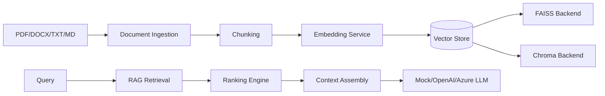
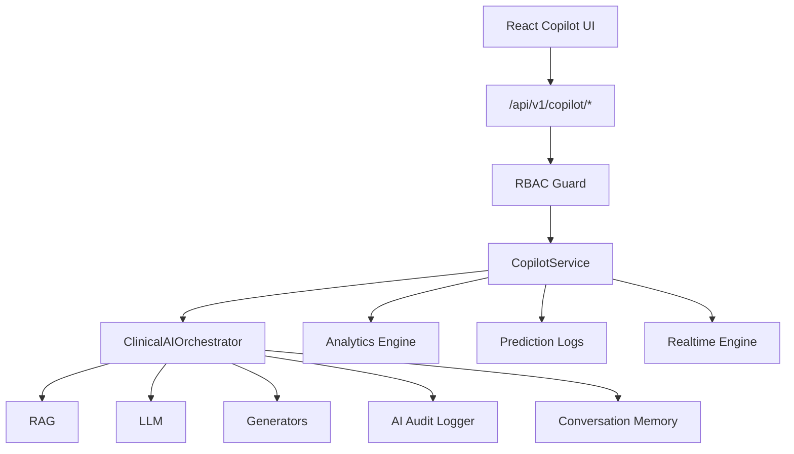

# PREMONITION — Section 12 Clinical AI Copilot

## Folder Structure

```
src/premonition/copilot/
├── llm/           # Provider abstractions (mock, OpenAI, Azure)
├── prompts/       # Template registry + version tracking
├── rag/           # Chunking, embeddings, vector stores, retrieval
├── generators/    # Patient summary, handover, explanations
├── agents/        # Multi-step workflow engine
├── memory/        # Conversation persistence
├── audit/         # AI response audit logging
├── orchestrator.py
└── service.py

frontend/src/
├── pages/CopilotPage.tsx
├── pages/CopilotPatientPage.tsx
├── pages/CopilotExecutivePage.tsx
├── components/copilot/
└── api/copilotEndpoints.ts
```

## RAG Architecture



## Copilot Architecture



## Security Model

| Permission | Roles |
|------------|-------|
| `copilot:use` | admin, clinician, executive |
| `copilot:read` | all roles |
| `copilot:ingest` | admin, clinician |
| `copilot:executive` | admin, executive |

Every response is audit-logged with prompt version, retrieval trace, and citations.

## Example Prompt

```
Context:
[1] Sepsis-3 criteria for ICU patients...
[2] SSC Hour-1 Bundle requirements...

User: What should I do for a patient with risk score 0.72?
```

## Example Response

```
Based on available PREMONITION platform data, regarding your question about
'risk score 0.72': the clinical AI copilot recommends obtaining blood cultures,
measuring lactate, and initiating antibiotics per the SSC Hour-1 Bundle.
Referenced 2 context lines. Please verify all recommendations with clinical judgment.
```
