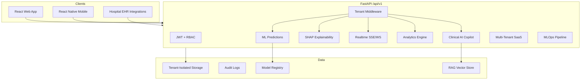

# PREMONITION — Final Architecture

## System Overview

PREMONITION is an enterprise-grade Clinical AI Copilot platform for ICU sepsis early warning.

## Module Map (16 Sections)

| Section | Module | Path |
|---------|--------|------|
| 1-3 | ML Pipeline | `src/premonition/training/`, `models/` |
| 4-5 | API + Auth | `src/premonition/api/`, `auth/` |
| 6-7 | Realtime + 3D | `realtime/`, `frontend/src/three/` |
| 8-9 | Frontend | `frontend/` |
| 10 | Production/MLOps | `mlops/`, `ops/`, `infra/k8s/` |
| 11 | Analytics | `analytics/` |
| 12 | Copilot | `copilot/` |
| 13 | Multi-Tenant SaaS | `tenant/` |
| 14 | Cloud Deployment | `infra/terraform/`, `infra/aws|azure|gcp/` |
| 15 | Mobile | `mobile/` |
| 16 | Launch Package | `docs/FINAL_*.md` |

## SaaS Architecture

- **Shared platform** with strict tenant isolation (RLS pattern)
- **Tenant context** via `X-Tenant-ID` header or JWT `tenant_id` claim
- **Per-tenant data** under `logs/tenants/{tenant_id}/`
- **Scalable** to 1000+ hospitals via horizontal K8s scaling

## Security Architecture

- JWT Bearer + API Key + RBAC (4 platform roles + 8 tenant roles)
- CSRF protection, rate limiting, OWASP security headers
- AI audit logging with retrieval trace and citations
- Tenant billing and usage metering
