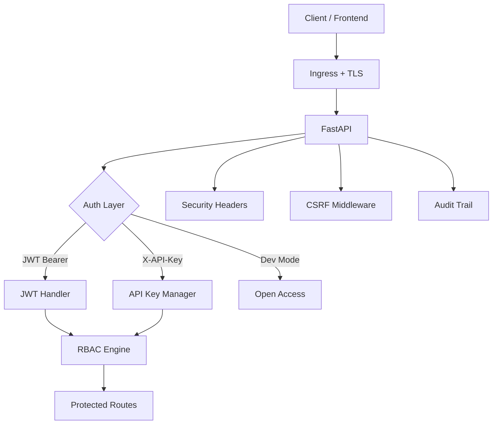
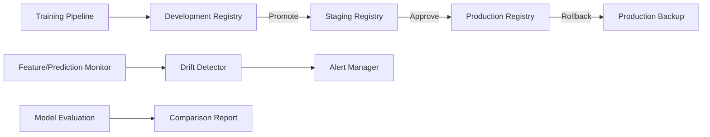
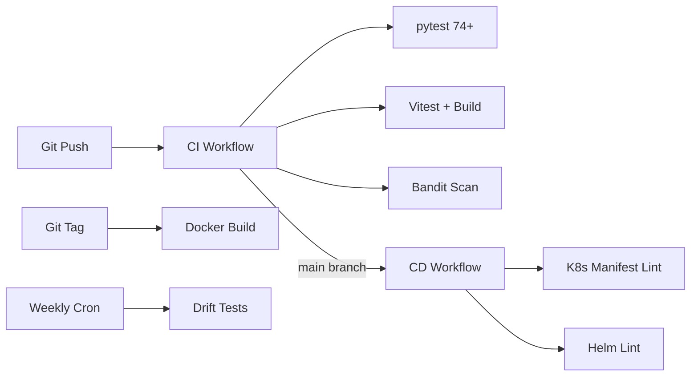
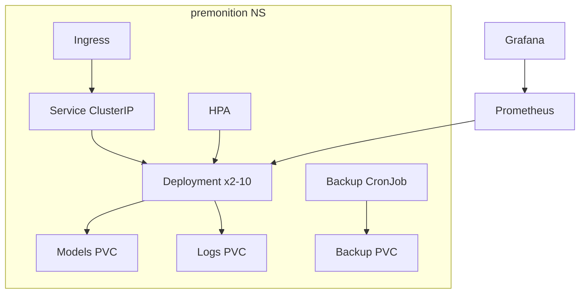

# PREMONITION — Production Deployment Guide

## Folder Structure (Section 10)

```
premonition/
├── .github/workflows/          # CI/CD pipelines
│   ├── ci.yml                  # Test + lint
│   ├── build.yml               # Docker build
│   ├── cd.yml                  # Deploy validation
│   └── mlops.yml               # Drift + evaluation
├── docs/
│   └── PRODUCTION.md           # This guide
├── infra/
│   ├── helm/premonition/       # Helm chart
│   ├── k8s/                    # Kubernetes manifests
│   └── monitoring/             # Prometheus, Grafana, Alertmanager
├── src/premonition/
│   ├── auth/                   # JWT, RBAC, API keys
│   ├── mlops/                  # Drift, promotion, monitoring
│   └── ops/                    # Backup, alerting, secrets, audit
└── tests/
    ├── test_auth.py
    ├── test_rbac.py
    ├── test_security.py
    ├── test_drift.py
    ├── test_mlops.py
    ├── test_monitoring.py
    ├── test_deployment.py
    └── test_backup.py
```

## Security Architecture



**Roles:** admin, clinician, executive, auditor (read-only)

## MLOps Architecture



## CI/CD Architecture



## Kubernetes Architecture



## Monitoring Architecture

- **Prometheus** scrapes `/api/v1/metrics/prometheus`
- **Grafana** dashboard: predictions, alerts, latency, model status
- **Alertmanager** routes critical alerts to on-call
- **In-app**: `AlertManager`, `FeatureMonitor`, `PredictionMonitor`

## Backup Architecture

| Schedule | Components | Retention |
|----------|-----------|-----------|
| Daily | models, logs | 30 days |
| Weekly | models, logs, data | 90 days |
| On-demand | model artifacts | K8s CronJob 02:00 UTC |

## Deployment Workflow

1. Train model: `python scripts/train.py --tier t1`
2. Configure secrets: `PREMONITION_JWT_SECRET`, CORS origins
3. Build image: `docker build -t premonition-ml:0.1.0 .`
4. Deploy K8s: `kubectl apply -f infra/k8s/`
5. Or Helm: `helm upgrade --install premonition infra/helm/premonition -f values-production.yaml`
6. Verify: `curl https://api.premonition.health/api/v1/health`

## Release Workflow

1. Feature branch → PR → CI passes
2. Merge to `main` → CD validates manifests
3. Tag `v*` → Docker image build
4. MLOps: promote staging → approve production
5. Rolling update via K8s (maxUnavailable: 0)
6. Rollback: `POST /api/v1/mlops/rollback` or `helm rollback`

## Production Checklist

- [ ] `PREMONITION_JWT_SECRET` set (32+ random bytes)
- [ ] Legacy `PREMONITION_API_KEY` rotated or disabled
- [ ] CORS restricted to frontend origin
- [ ] TLS terminated at ingress
- [ ] Model trained and promoted to production
- [ ] Prometheus + Grafana monitoring active
- [ ] Daily backup CronJob scheduled
- [ ] Alertmanager configured with on-call email
- [ ] RBAC roles assigned to all users
- [ ] Drift detection scheduled (weekly MLOps workflow)
- [ ] Health probes passing (liveness + readiness)
- [ ] HPA min 2 replicas for HA

## Cloud Readiness

| Provider | Ingress | Storage | Secrets |
|----------|---------|---------|---------|
| AWS | ALB Ingress Controller | EFS (RWX PVC) | AWS Secrets Manager |
| Azure | App Gateway Ingress | Azure Files | Key Vault |
| GCP | GCE Ingress | Filestore | Secret Manager |

Replace `secret.yaml` stringData with external secrets operator in production.
